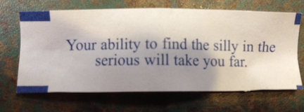
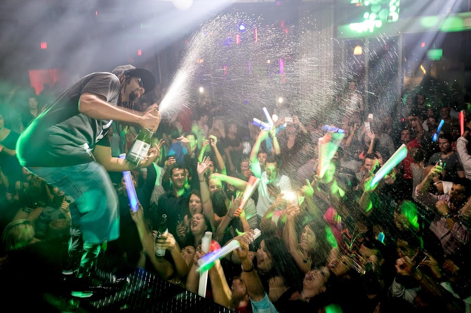

# Fun w/R: `BRRR` Demo

##### This demo will show you how to use Brook Watson Madubuonwu's [`BRRR`](https://github.com/brooke-watson/BRRR) package which let's a rapper tell you when your code is done running, like Lil John yelling "Yeah!"

##### It's inspired by Rasmus Bååth's [`beepr`](https://github.com/rasmusab/beepr) package which lets you use more conventional noises like themes from video games. I'll cover `beepr` a bit at the end.

##### Follow along with the code in BRRR_demo.nb.html, and be sure to check out Brook's awesome [blog](https://brooke.science/) for more fun w/R.
